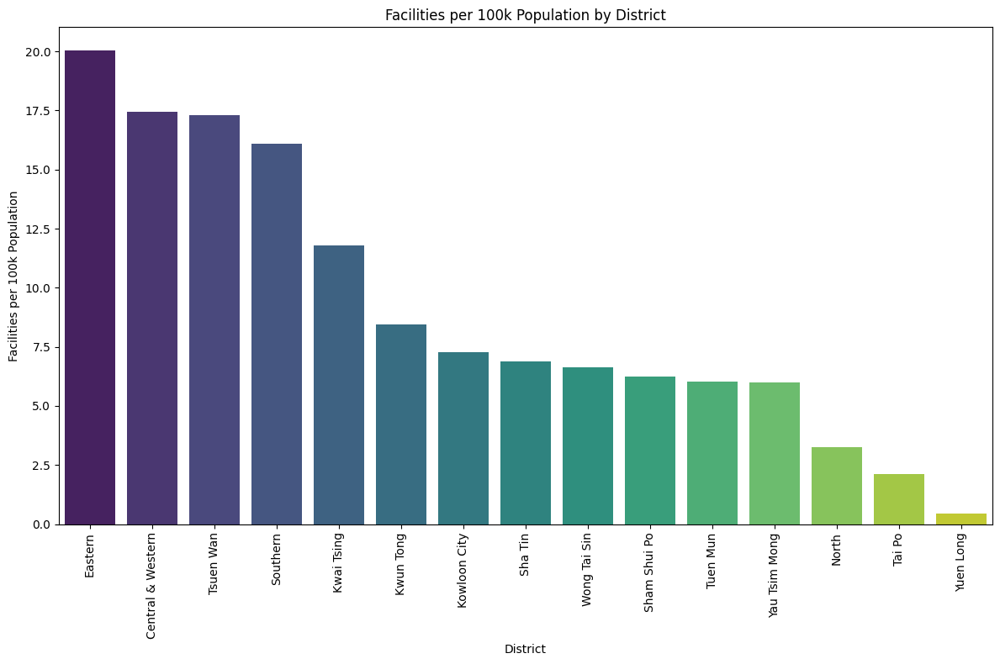

<h1 align="center">🏢 <b>Hong Kong Mini-Storage Data Analysis</b></h1>

Exploring Hong Kong’s mini-storage market using open data, SQL, and Python. 
Identifying potential business opportunities for <b>Restore HK 原儲存</b>.

---

### 🎯 Objective

- **Clean and join** facility and population datasets  
- **Calculate** facility density per 100 000 residents  
- **Visualize** district-level differences  
- **Demonstrate** SQL Anywhere-compatible queries for reporting or automation  

---

### 🧹 Data Cleaning Workflow

| 🪜 Step | 🧩 Description |
|:--:|:--|
| 1️⃣ | Standardized district names (removed 「區」, unified spellings, merged variants like *Wanchai → Wan Chai*) |
| 2️⃣ | Joined facility + population tables by normalized district names |
| 3️⃣ | Aggregated total facilities per district |
| 4️⃣ | Calculated facilities per 100 000 residents |
| 5️⃣ | Exported clean results to CSV and SQLite DB |

**Tools used:** Python (Pandas · Regex), Google Colab Notebook, Matplotlib  

---

### 📊 Visualization

*(Generated in Google Colab using Matplotlib)*  

Districts such as **Eastern**, **Central & Western**, and **Tsuen Wan** show the highest density of mini-storage facilities,  
while **Sai Kung**, **North**, and **Tai Po** remain under-served.

🔗 Open in Colab

